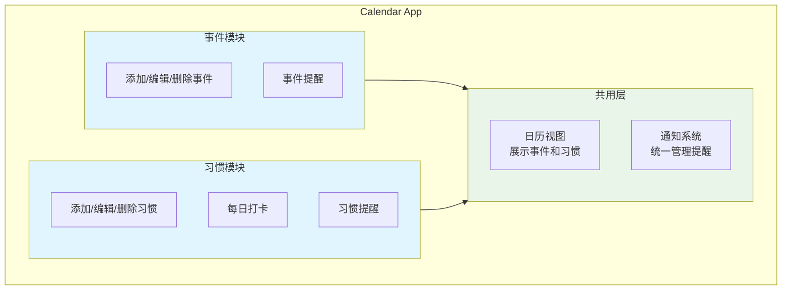

## 一、项目简介

Calendar 是一款以日历为核心的个人管理 Android 应用，整合了**事件管理**和**习惯打卡**两大功能模块，帮助用户在统一的日历视图中管理日常安排和习惯。


**核心特点**
- **日历为中心** - 所有信息围绕日历展示，一目了然
- **事件管理** - 添加、编辑、删除日程事件，支持提醒
- **习惯打卡** - 创建习惯、每日打卡、追踪完成情况
- **本地存储** - 使用 Room 数据库，数据完全离线可用


---

## 二、功能需求

### 2.1 模块划分

整个应用分为两个核心模块和一个共用层：

### 2.2 功能清单


<!-- tab 日历模块 -->
| 功能 | 描述 |
|------|------|
| 查看日历 | 月视图展示，标记有事件/习惯的日期 |
| 查看当日详情 | 点击日期显示当天的事件和习惯 |
<!-- endtab -->

<!-- tab 事件模块 -->
| 功能 | 描述 |
|------|------|
| 添加事件 | 输入标题、时间、备注 |
| 编辑事件 | 修改已有事件信息 |
| 删除事件 | 删除不需要的事件 |
| 事件提醒 | 设置提醒时间，到点推送通知 |
<!-- endtab -->

<!-- tab 习惯模块 -->
| 功能 | 描述 |
|------|------|
| 添加习惯 | 输入习惯名称、提醒时间 |
| 编辑习惯 | 修改习惯信息 |
| 删除习惯 | 删除不再跟踪的习惯 |
| 每日打卡 | 标记今日习惯完成/未完成 |
| 习惯提醒 | 设置提醒时间，到点推送通知 |
<!-- endtab -->

<!-- tab 通知模块 -->
| 功能 | 描述 |
|------|------|
| 接收通知 | 系统根据提醒设置推送通知 |
<!-- endtab -->


---

## 三、用例分析

### 3.1 用例图

### 3.2 用例说明

| 用例 | 参与者 | 描述 |
|:-----|:-------|:-----|
| 查看日历 | 用户 | 查看月历视图，浏览选中日期的事件和习惯 |
| 管理事件 | 用户 | 对事件进行增删改操作，可设置提醒时间 |
| 管理习惯 | 用户 | 对习惯进行增删改操作，可设置每日提醒 |
| 打卡习惯 | 用户 | 完成或取消今日习惯的打卡状态 |
| 接收通知 | 用户、系统 | 用户接收系统根据提醒时间发送的通知 |

### 3.3 用例关系


- **包含关系 `<<include>>`**：管理事件/习惯时可以设置提醒
- **扩展关系 `<<extend>>`**：设置的提醒会触发系统通知


---

## 四、开发计划

项目采用渐进式开发，每个阶段完成后都是可运行的完整功能：


<!-- timeline 阶段一：基础框架 -->
- 项目搭建，MVVM 架构
- 日历控件集成
- 事件数据表设计（Room）
- 事件的增删改查

**产出**：可添加和查看事件的基础日历应用
<!-- endtimeline -->

<!-- timeline 阶段二：习惯模块 -->
- 习惯数据表设计
- 打卡记录表设计
- 习惯管理功能
- 每日打卡功能

**产出**：支持事件管理和习惯打卡的完整应用
<!-- endtimeline -->

<!-- timeline 阶段三：通知提醒 -->
- 事件提醒通知
- 习惯提醒通知
- 通知权限处理

**产出**：支持提醒功能的实用应用
<!-- endtimeline -->


---

## 五、技术选型

| 层级 | 技术方案 |
|:-----|:---------|
| 语言 | Kotlin + Java |
| 架构 | MVVM + Repository |
| 数据库 | Room |
| 日历 | CalendarView / 自定义实现 |
<!-- | 异步 | Kotlin Coroutines + Flow | -->
<!-- | 通知 | AlarmManager + NotificationManager | -->

<!-- ## 下一篇 -->

<!-- [Calendar 日历应用 - 系统架构设计](/calendar-02-architecture/) -->
