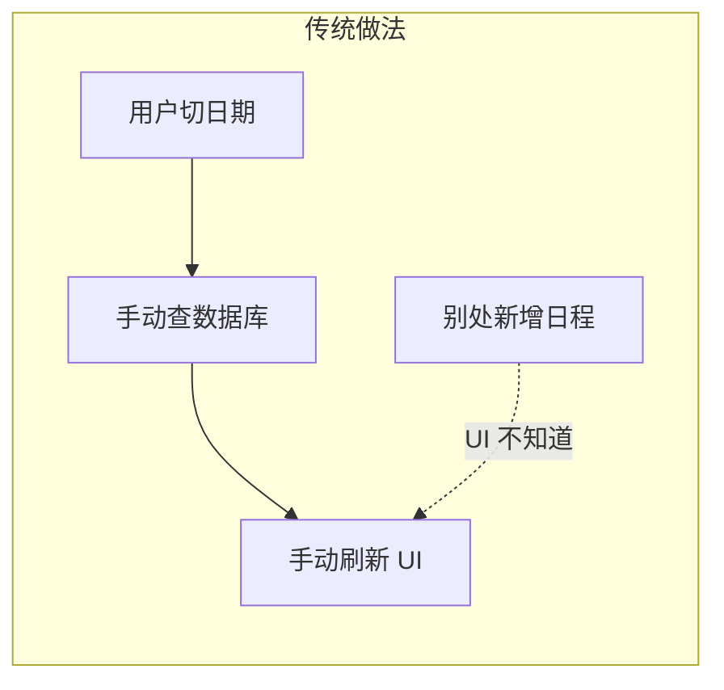
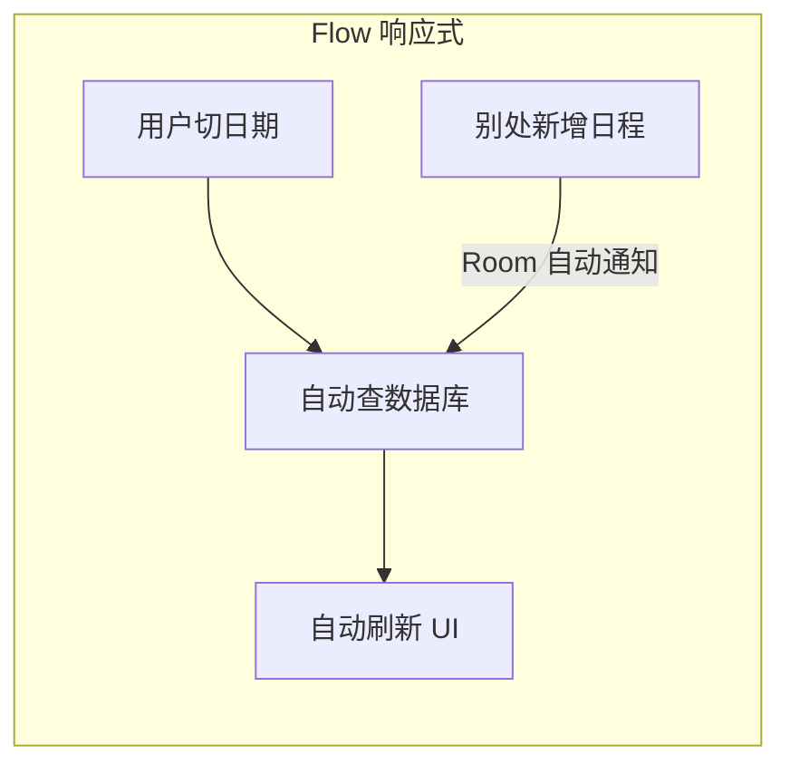
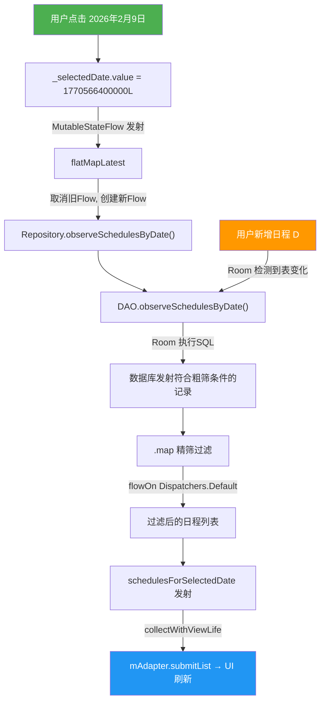

以 Calendar 日历应用为例，记录 Flow 从数据库到 UI 的完整使用。

---

## 一、为什么用 Flow

传统做法：用户切换日期 → 手动调 API 查数据库 → 手动刷新 UI。如果数据库被别处修改了（比如新增了日程），UI 不会自动更新。

Flow 是响应式数据流：**数据库数据一变，UI 自动收到通知并刷新**，不需要手动操作。





---

## 二、Flow 从哪里产生

起点在 `ScheduleDao.kt`：

```kotlin
@Query(
    """
    SELECT * FROM schedules
    WHERE date = :targetDate
       OR (repeatRule IS NOT NULL AND date <= :targetDate)
    ORDER BY startTime ASC
    """
)
fun observeSchedulesByDate(targetDate: Long): Flow<List<ScheduleEntity>>
```

Room 的 `@Query` 返回 `Flow` 时，会**自动监听 `schedules` 表的变化**。只要表中有 insert/update/delete 发生，Room 就会重新执行这条 SQL，并向 Flow 发射新数据。


**这条 SQL 做的是"粗筛"**
- 条件1：`date = targetDate` → 查出当天的普通日程
- 条件2：`repeatRule IS NOT NULL AND date <= targetDate` → 查出所有"已开始"的重复日程
- 精确过滤交给 Repository 层完成


这是整条链路的**源头**。

---

## 三、Flow 在 Repository 中的变换

`ScheduleRepository.kt`：

```kotlin
fun observeSchedulesByDate(targetDate: Long): Flow<List<ScheduleEntity>> {
    return scheduleDao.observeSchedulesByDate(targetDate)
        .map { list ->                          // 操作符：对每次发射的数据做变换
            list.filter { schedule ->
                if (schedule.repeatRule == null) true
                else schedule.repeatRule.matches(schedule.date, targetDate)
            }
        }
        .flowOn(Dispatchers.Default)            // 指定上游（map）在计算线程执行
}
```

两个关键操作符：

- `.map {}` — 每次 DAO 发射一个 `List<ScheduleEntity>`，map 就对它做**精筛过滤**，产出一个新的 list 继续往下游传
- `.flowOn(Dispatchers.Default)` — 把 map 里的过滤逻辑切到**后台计算线程**，不阻塞主线程。注意 `flowOn` 只影响它**上游**的代码

```
DAO 发射数据 (IO线程)
    ↓
.map { 精筛过滤 } (Dispatchers.Default, 计算线程)
    ↓
下游收集 (主线程)
```


**扩展: 粗筛 + 精筛的例子**
数据库中有 3 条记录，用户点击 2026-02-09（周一）：
- A：date=2026-02-09，repeatRule=null，title="小明生日" → 普通日程
- B：date=2026-02-02（周一），repeatRule=WEEKLY，title="健身房" → 每周一
- C：date=2026-02-01，repeatRule=MONTHLY，title="发工资" → 每月1号

DAO 粗筛（SQL 条件：`date = targetDate OR (repeatRule IS NOT NULL AND date <= targetDate)`）：
- A：date=02-09 = targetDate → **命中条件1** ✓
- B：repeatRule=WEEKLY 且 date=02-02 <= 02-09 → **命中条件2** ✓
- C：repeatRule=MONTHLY 且 date=02-01 <= 02-09 → **命中条件2** ✓
→ 粗筛结果：**A、B、C 共 3 条**

Repository 精筛（`repeatRule.matches(originDate, targetDate)`）：
- A：repeatRule=null → **保留**
- B：WEEKLY.matches(02-02, 02-09) → 都是周一 → **保留**
- C：MONTHLY.matches(02-01, 02-09) → "01" != "09" → **过滤掉**

最终结果：**A + B = 2 条**


---

## 四、Flow 在 ViewModel 中的切换

`CalendarViewModel.kt`：

```kotlin
// 当前选中的日期(毫秒,精确到当天零点)
private val _selectedDate = MutableStateFlow(getTodayMillis())

// 自动跟随 _selectedDate 切换,查询对应日期的日程列表
@OptIn(kotlinx.coroutines.ExperimentalCoroutinesApi::class)
val schedulesForSelectedDate: Flow<List<ScheduleEntity>> =
    _selectedDate.flatMapLatest { getSchedulesByDate(it) }
```

### 4.1 MutableStateFlow

`_selectedDate` 是一个 StateFlow，它本身也是 Flow，但：

- 始终持有一个**当前值**（初始值是今天零点的毫秒时间戳）
- 值变化时会向下游**发射新值**
- 跟普通 Flow 的区别：**有状态**，可以随时 `.value` 读取当前值

当用户点击某天时调用 `selectDate(dateMillis)`（第 36-38 行），就是在更新这个 StateFlow 的值：

```kotlin
fun selectDate(dateMillis: Long) {
    _selectedDate.value = dateMillis
}
```

### 4.2 flatMapLatest

这是**核心连接点**。它的作用是：

```
_selectedDate 发射日期 A
    → flatMapLatest 用日期 A 调用 getSchedulesByDate(A)，得到 Flow-A，开始收集

_selectedDate 发射日期 B（用户切了一天）
    → flatMapLatest 立刻 **取消** Flow-A 的收集
    → 用日期 B 调用 getSchedulesByDate(B)，得到 Flow-B，开始收集
```

**"Latest" 的含义**：只关心最新选中的日期，旧日期的查询自动取消。如果用户快速连续点了 3 天，只有最后一天的查询会保留。


**对比其他操作符**

| 操作符 | 行为 |
|--------|------|
| `flatMapLatest` | 取消旧的，只保留最新 ← **这里用的** |
| `flatMapConcat` | 排队，一个完了再执行下一个 |
| `flatMapMerge` | 全部并发执行，不取消 |


---

## 五、Flow 在 UI 层的收集

`CalendarFragment.kt`：

```kotlin
override fun initObserve() {
    // 收集日程列表,自动跟随选中日期切换
    mCalendarViewModel.schedulesForSelectedDate.collectWithViewLife { list ->
        mAdapter.submitList(list)
    }
}
```

`collectWithViewLife` 是在 `BaseFragment.kt` 定义的扩展函数：

```kotlin
protected fun <T> Flow<T>.collectWithViewLife(
    context: CoroutineContext = EmptyCoroutineContext,
    state: Lifecycle.State = Lifecycle.State.STARTED,
    block: suspend CoroutineScope.(T) -> Unit
) {
    viewLifecycleOwner.lifecycleScope.launch(context) {
        viewLifecycleOwner.repeatOnLifecycle(state) {
            collect { value -> block(value) }
        }
    }
}
```


**为什么要用 `repeatOnLifecycle` 而不是直接 `collect`？**
直接用 `lifecycleScope.launch` 收集 Flow，App 进入后台时**仍然会继续收集**，浪费资源甚至引发崩溃。`repeatOnLifecycle(STARTED)` 会在生命周期低于 STARTED 时**自动取消**收集，重新回到 STARTED 时**重新开始**收集。


用户点击日期触发的入口在 `CalendarFragment.kt`：

```kotlin
override fun onCalendarSelect(calendar: Calendar?, isClick: Boolean) {
    calendar ?: return
    val dateMillis = calendarToMillis(calendar.year, calendar.month, calendar.day)
    mCalendarViewModel.selectDate(dateMillis)  // 更新 StateFlow → 触发整条链路
}
```

---

## 六、完整数据流图



---

## 七、总结

这个项目里 Flow 有**三种角色**：


**1. Room Flow（DAO 层）**
数据源，数据库变了就自动发射
`ScheduleDao.kt` → `observeSchedulesByDate()` 返回 `Flow<List<ScheduleEntity>>`

**2. 操作符变换（Repository 层）**
`.map` 精筛 + `.flowOn` 切线程
`ScheduleRepository.kt` → 过滤重复日程，在计算线程执行

**3. StateFlow + flatMapLatest（ViewModel 层）**
把"选日期"这个动作也变成 Flow，与查询 Flow 串联，实现日期切换时自动查新数据、取消旧查询
`CalendarViewModel.kt` → `_selectedDate.flatMapLatest { ... }`


整条链路中，**没有一行"手动刷新 UI"的代码** —— 数据从 Room 流出，经过 Repository 变换，通过 ViewModel 的 StateFlow 切换，最终自动到达 UI 层。这就是 Flow 响应式编程的核心价值。
